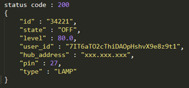
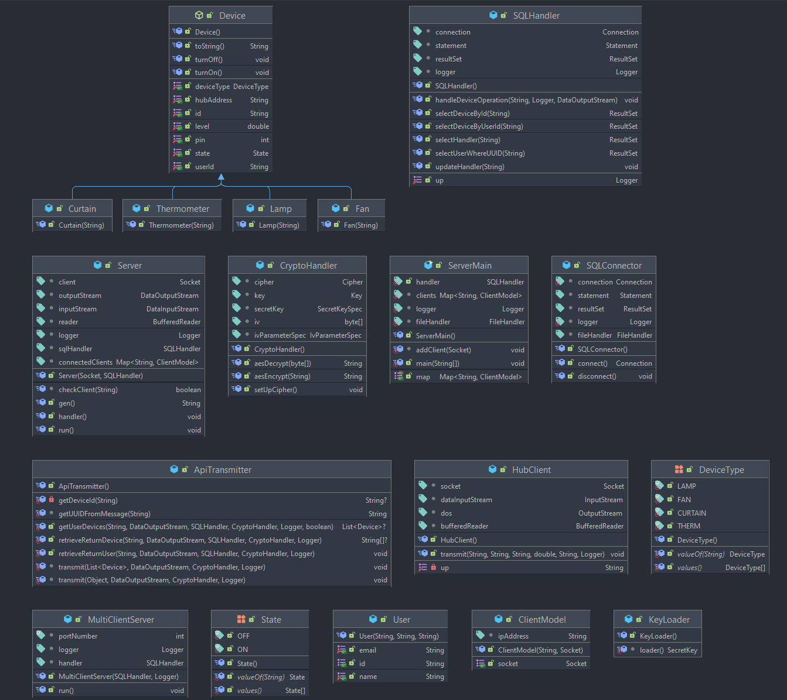
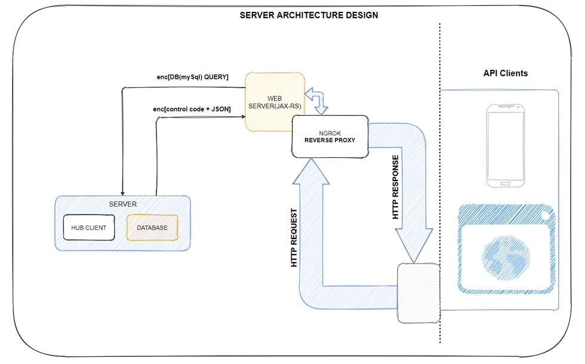
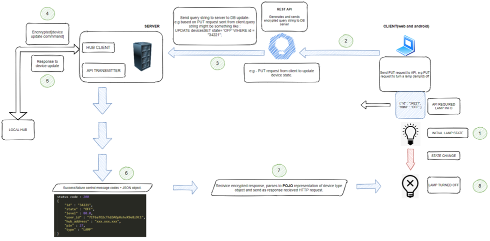

## HOMEDORK's DATABASE SERVER

### Communicates with Homedork's API and user's local hub
* ### Communication with API
  > The API acts as a client to this DB server, constructs corresponding DB queries based on received http requests.
* ### Communication with Local hub
  > Each User's local hub communicates with this server for device based operations
  >
  > A TCP socket is created between this server and the corresponding hub with the hub's address gotten from the device
  > object being updated.
>
* API HTTP requests are followed down here for Database CRUD operations and signalling the local hub in use.
* ### HTTP request (GET, POST, PUT, DELETE, ...)
  > On HTTP requests to the [API](https://github.com/homedork-se2/hd-API), the [QueryBuilder](https://github.com/homedork-se2/hd-API/blob/main/src/main/java/homedork/code/hdapi/dataservices/QueryBuilder.java)
  > is invoked in regard to the service class the called its method. The appropriate query sent to the server socket, processed, and the API is responded to.
  > #### RESPONSE (TO API)
  > > ON DB **SELECT**,**INSERT**,**DELETE** or **UPDATE** the updated object is sent back, suffixed to a _**status code**_.
  >
  > FORMAT OF SERVER RESPONSE TO API
  > > 
  >
  > CONTROL MESSAGE CODES
  > > 
* Encrypted TCP channels for communication to both API and local hub.
* ### Project dependencies
  > | Dependency                                                                       | Use                  |
    > |----------------------------------------------------------------------------------|----------------------|
  > | [MYSQL connector](https://mvnrepository.com/artifact/mysql/mysql-connector-java) | Database             |
  > | [JUNIT](https://mvnrepository.com/artifact/junit/junit)                          | Junit test framework |
  > | [GSON](https://mvnrepository.com/artifact/com.google.code.gson/gson)             | JSON parsing         |
  > | [JSON](https://mvnrepository.com/artifact/org.json/json)                         | JSON parsing         |

* ### SERVER CLASS DIAGRAM
  > 
  >
  > Server classes diagram
* ### SERVER ARCHITECTURE
  > 
  >
  > Overview of the current's server architecture without encryption/decryption layers added.
>
* ### COMMUNICATION DESIGN
  > 
  >
  > Communication design for all nodes in the network.
* #### DEVELOPED BY:
  * [Lukas Olson](https://github.com/OlssonLukas) - Group Leader
  * [Besnik](https://github.com/besnikskola)
  * [Bujar](https://github.com/bujarr)
  * [Wills Ekanem](https://github.com/Willz01)
