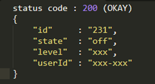
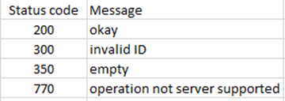

## HOMEDORK's DATABASE SERVER

* Communicates with Homedork's API and user's local hub
* ### Communication with API
  > The API acts as a client to this DB server, constructs corresponding DB queries based on received http requests.
* ### Communication with Local hub
  > Each User's local hub communicates with this server for device based operations
  >
  > This server saves a map of all connected sockets/clients (API + hub(s)) with `key=address`
  >
  > `static Map<String, ClientModel> clients = new HashMap<>();`
  >
  > New accepted socket clients are added to the haspMap. (Check [MultiClientServer](https://github.com/homedork-se2/hd-server/blob/main/src/main/java/homdork/code/comm/MultiClientServer.java) and [ServerMain](https://github.com/homedork-se2/hd-server/blob/main/src/main/java/homdork/code/comm/ServerMain.java) for more info.)
  >
  > `clientSocket = serverSocket.accept();`
  >
  > `ServerMain.addClient(clientSocket);`
  >
  > When communicating with a specific hub on **DEVICE UPDATE**, the device address is used to get the right hub from
  > connected clients map to access its socket.
* API HTTP requests are followed up down here for Database CRUD operations
* ### HTTP request (GET, POST, PUT, DELETE, ...)
  > On HTTP requests to the [API](https://github.com/homedork-se2/hd-API), the [QueryBuilder](https://github.com/homedork-se2/hd-API/blob/main/src/main/java/homedork/code/hdapi/dataservices/QueryBuilder.java)
  > is invoked in regard to the service class the called its method. The appropriate query sent to the server socket, processed, and the API is responded to.
  > #### RESPONSE (TO API)
  > > ON DB **SELECT**,**INSERT**,**DELETE** or **UPDATE** the updated object is sent back, suffixed to a _**status code**_.
  >
  > FORMAT OF SERVER RESPONSE TO API
  > > 
  >
  > CONTROL MESSAGE CODES
  > > 
* Encrypted TCP channels for communication to both API and local hub.
* ### Project dependencies
  > [MYSQL connector](https://mvnrepository.com/artifact/mysql/mysql-connector-java) - for database
  >
  > [JUNIT](https://mvnrepository.com/artifact/junit/junit) - Junit testing
  >
  > [GSON](https://mvnrepository.com/artifact/com.google.code.gson/gson) - processing and building json objects

* ### SERVER CLASS DIAGRAM
  > 
  >
  > Server classes diagram
* ### SERVER ARCHITECTURE
  > 
  >
  > Overview of the current's server architecture without encryption/decryption layers added.
* #### DEVELOPED BY:
    * [Lukas Olson](https://github.com/OlssonLukas) - Group leader
    * [Besnik](https://github.com/besnikskola)
    * [Bujar](https://github.com/bujarr)
    * [Wills Ekanem](https://github.com/Willz01) - Project manager